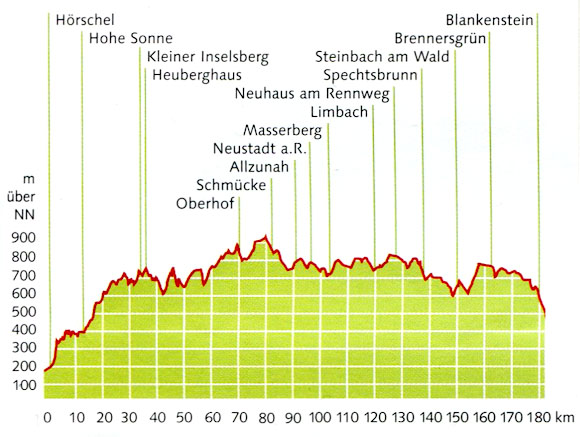

# Rennsteig-Tour
***
Region: Thüringer Wald
Distanz: 195km
Höhenmeter: 2910m (O->W), 3130m (W->O)

Tags: #ultra-long-ride #tour #fahrrad 
***
 "Höhenprofil Rennsteig"

```leaflet
id: rennsteig
gpx: [[Rennsteig.gpx]]
lat: 50.6
long: 10.9
unit: meters
defaultZoom: 8
```

[Route bei Komoot](https://www.komoot.com/de-de/tour/2293492490)
[offizielle Website](https://www.rennsteig.de/radweg)

## Zeitschätzung

| Leistung [W] | km/h      | Fahrzeit [h] |     |
| ------------ | --------- | ------------ | --- |
| **100**      | **14.54** | **13:37:35** |     |
| **120**      | **16.63** | **11:54:49** |     |
| 140          | 18.55     | 10:40:56     |     |
| 160          | 20.32     | 09:45:07     |     |
| 180          | 21.96     | 09:01:23     |     |

## Etappenplanung für 3 Tage
Bei 120W Durchschnitt ergeben sich damit 4h Fahrzeit pro Tag.

Wir fahren von Bad Blankenstein nach Hörschel (Ost->West-Route)
- 300 hm weniger
- letzten 25km kraftsparend & schnell, da konstant bergab
- der Westen des **R** liegt nahe an unseren Homebases: bei Abbruch kein logistisches Problem
- Eisenach hat bessere Bahnverbindungen als Blankenstein (nach Arnstadt bis 22:16)

**Etappe 1**
Blankenstein -> Scheibe-Alsbach
Distanz: ~70km

Start ab **Arnstadt Hbf** erster Zug geht **8:00** RB23 -> Saalfeld RB32 9:07 -> Ankunft 10:15

**Unterkünfte**
	- ~Elkes Jägerstube, Tel. 036704/80193, Preis 110€~
	- Gasthof Thomas Münzer: 150€

**Strecken-Profil**
- ersten 20km konstant bergauf ~ 300hm
- bei km 50 nochmals 100-150hm
- sonst wellig

**Untergrund**
unklar, Gravel(?)

**Etappe 2**
Scheibe-Alsbach -> Tambach-Dietharz
Distanz: ~77km

**Unterkünfte**
- Ferienpark Ebertswiese
- Ebertswiese
- Hotel in Tambach-Dietharz

Terrain: wellig
Untergrund: Asphalt, schneller Gravel

**Etappe 3**
Tambach-Dietharz -> Hörschel (Gotha)

**Erreichen der RB nach Arnstadt bis spätestens 20:31!** (davor alle 2h)

Terrain: wellig überwiegend abfallend
Untergrund: Asphalt, schneller Gravel

# Packlist
[[Packliste]]
